# PyShop

PyShop is a web application built with Django 2.1 that allows users to browse products, manage their cart, and place orders. It also includes an admin panel for managing products, offers, and customers.

## Getting Started

### Prerequisites
Before running this project, ensure you have:

- Python installed on your system
- Django 2.1 installed

### Installation and Setup
Follow these steps to get started with PyShop:

1. **Download and Extract**  
   - Download `pyshop.zip` and extract its contents.

2. **Open in IDE**  
   - Open the extracted folder in an IDE (e.g., Visual Studio Code).

3. **Install Dependencies**  
   - Install Django 2.1 by running the command:
     ```sh
     pip install django==2.1
     ```
     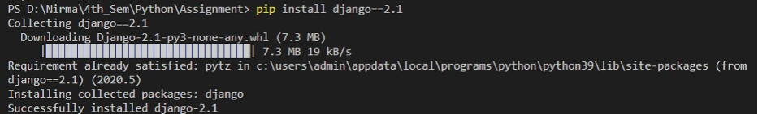

4. **Run the Django Server**  
   - Navigate inside the extracted folder and execute:
     ```sh
     python manage.py runserver
     ```
     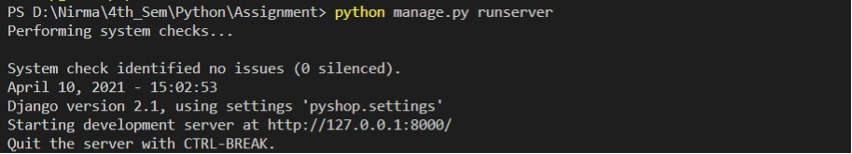
   - This starts the server. Open the generated link `http://127.0.0.1:8000/` in your browser to access the home page.

## Features

### User Side
- **Login/Signup Page**  
  - Users can create a new account or log in to an existing one.
  - Incorrect login credentials display "User Not Found."
   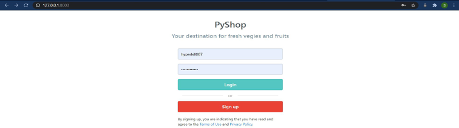
   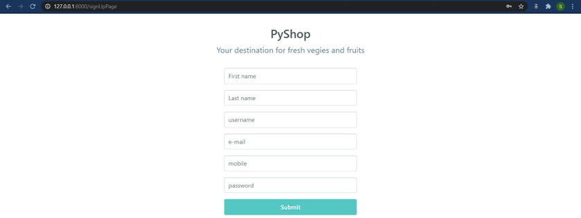
   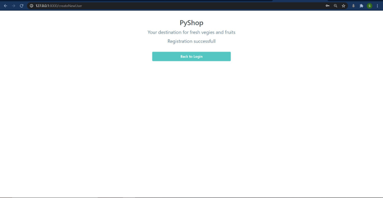
  
- **Products (Home) Page**  
  - Displays all available products.
  - Users can add products to their cart.
  - Navigation to profile, cart, and logout.
   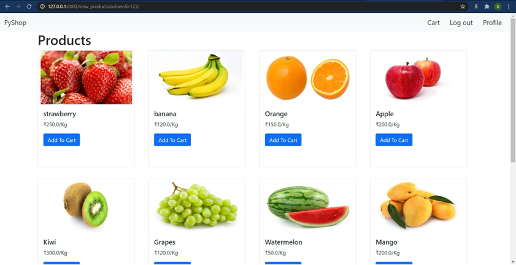

- **Profile Page**  
  - Displays user details.
  - Navigation options to Products, Cart, and Logout.
  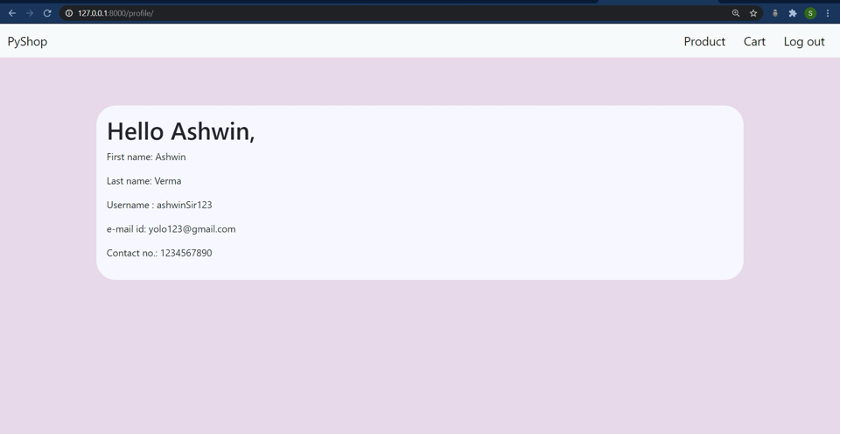

- **Cart Page**  
  - Displays selected products.
  - Users can add or remove items.
  - Clicking "Place Order" proceeds to checkout.
  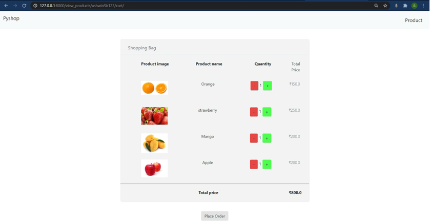

- **Checkout Page**  
  - Users provide details for order delivery.
  - All fields are mandatory.
  - Clicking "Submit" places the order.
   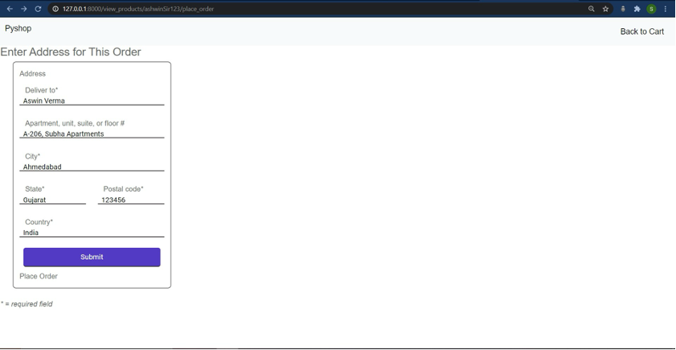

- **Order Confirmation Page**  
  - Displays an auto-generated message confirming the order.
  - Logout option is available.
  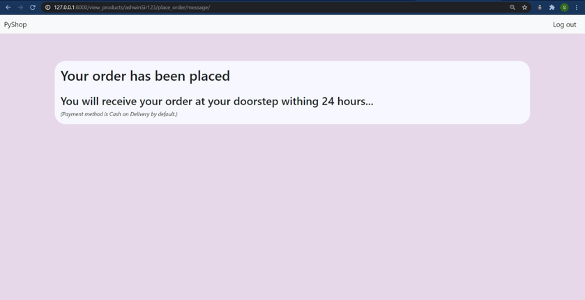

### Admin Side
- **Accessing Admin Panel**  
  - Navigate to `http://127.0.0.1:8000/admin`.
  - Login using:
    ```
    Username: admin
    Password: 1234
    ```
  - Alternatively, create a superuser using:
    ```sh
    python manage.py createsuperuser
    ```
   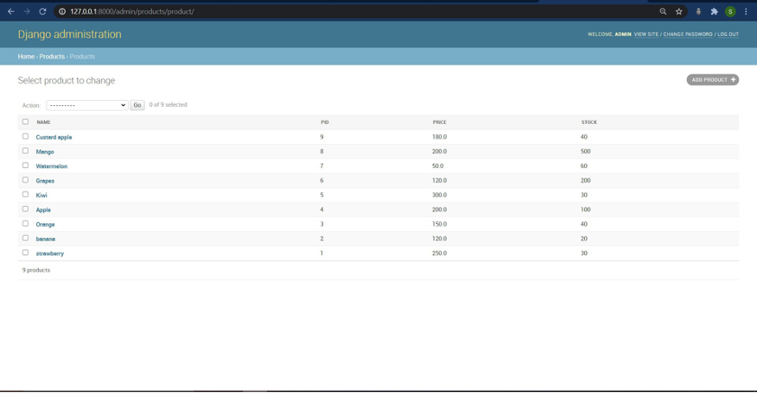

- **Admin Features**  
  - Manage and authorize all database details.
  - Add, update, or delete products.
  - Manage carts, products, offers, and customers.


## URLs
- User Login: `/login`
- Products Page: `/`
- Cart Page: `/cart`
- Checkout Page: `/checkout`
- Admin Panel: `/admin`

## License
This project is for educational purposes.
